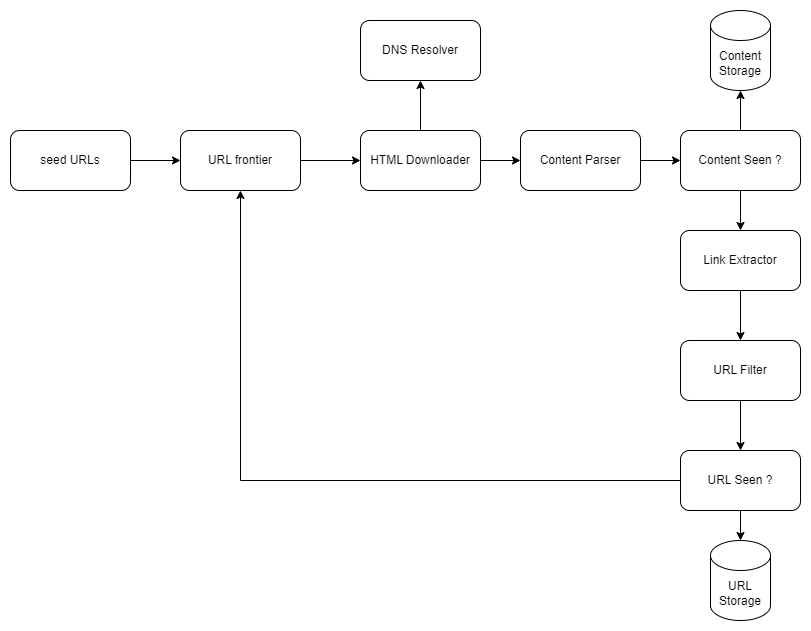

# Web Crawler

## Description

This is a CLI app that accepts a URL, recursively crawls all linked URLs on each webpage, and generates a comprehensive report of all discovered URLs.

The app implements concurrency using goroutines, significantly enhancing performance. Users can also specify the maximum number of goroutines and the number of pages to crawl, allowing for customizable and efficient operations.

## Quick Start

Clone the repo and run the following command.

    go build -o out && ./out 'url' 'max_goroutines' 'max_pages'

For eg.

    go build -o out && ./out https://www.chess.com/ 6 250

The parameters 'max_goroutines' and 'max_pages' are optional and if not provided they will default to 5 and 100 respectively. 

#### Tests

Use the following command in the root folder to run all tests in the project.
    
    go test ./...

## Design

Fig - High Level Design Diagram
  

#### Seed URLs

The app starts with a single URL passed as part of the command line arguments.

#### URL Frontier

The app currently uses DFS to determine the next URL to crawl. This is not ideal, as the depth of DFS can be very deep.
This results in the crawling of many unrelated links in the context of the given URL before the more relevant ones.

Although BFS would be good from the point of view of the web crawler as the more relevant URLs would be crawled earlier, it has 
one downside. Most links from the same web page link back to the same host. Thus if the crawler tries to make 
parallel requests, the host will be flooded with requests which is considered impolite and can potentially
even be seen as a denial-of-service (DOS) attack. Also, standard BFS doesn't take into account the priority of each web page.

Politeness can be addressed by having separate queues for each worked thread and limiting one host to a single worker 
thread. Thus even though parallel requests are happening, since requests to a particular host can only happen via one worker 
thread, there would be enough delay between requests.

Priority can be addressed by having another set of queues. Each queue can be assigned a different priority. A prioritizer can 
calculate the priority of each web page using PageRank, website traffic, update frequency, etc, and add a higher-priority URL to
a higher-priority queue. When selecting a queue, randomly take one with a bias toward higher priority.

Thus we can have two modules under the URL frontier. front queues for handling priority and then back queues for handling
politeness.

#### HTML Downloader

The HTML Downloader downloads the contents of a web page.

#### Content Parser

The app currently only extracts the links from the HTML. A future update could include parsing and validating the HTML as 
malformed web pages should be avoided.

#### 'Content Seen' and 'Content Storage' are potential updates in the future.

#### URL Extractor

URL extractor parses and extracts links from the HTML body. The relative paths are converted to absolute paths by 
prefixing the hostname to the URL.

#### URL Filter

This is a potential future update as URLs of specific types, file extensions, error links, and those from blacklisted 
sites can be discarded.

#### URL Seen? and URL Storage

The app stores URLs in a hashtable where the key is the URL and the value is the number of times the specific URL was seen.
Crawling of a URL happens only when the URL is seen for the first time. This is a necessary step as the server load is decreased
and potential infinite loops are avoided.

#### Report

The app finally prints a report of all the web pages crawled and the number of times each page was seen. The pages are 
considered in descending order of their count, prioritizing the more relevant pages. 